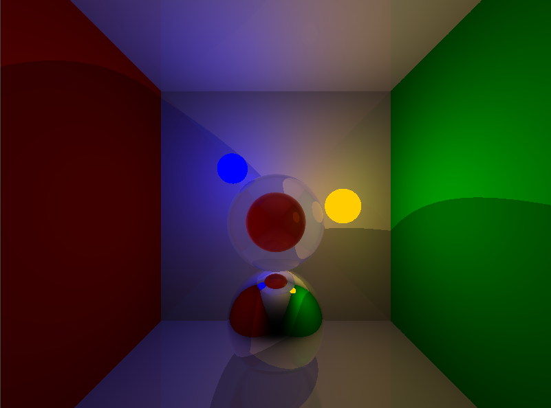

# GLRT
## About
GLRT, also known as `GLRaytracer`, `glraytracer`, or `glrt`, is a simple real-time raytracer written in C, using OpenGL. It uses a screen-filling quad, allowing us to run a shader for every pixel in the screen.
## Screenshot

## License
Everything in this project, except for what's inside `source/fragment.glsl` is licensed under the MIT license.